# AMBS (Asset Management & Billing System)

A web-based, end-to-end encrypted (E2EE) inventory management system with integrated billing support and low inventory alerts. Designed for maximum efficiency and zero-knowledge privacy, AMBS ensures your business data remains entirely in your control.

🔗 **Live Demo:** [https://avm3005.github.io/AMBS](https://avm3005.github.io/AMBS)

---

## ✨ Features

* **End-to-End Encryption (E2EE):** Your data is locked behind a strict Encryption PIN. Only you can access it.
* **Flexible Storage Options:** 
  * **Local Account:** Saves directly to the device's storage for lightning-fast, offline-capable usage.
  * **Google Account:** Securely backs up your encrypted data to the cloud.
* **Smart Billing:** Dynamic pricing adjustments at the point of sale, with options to process sales with or without generating an official bill.
* **Inventory Control:** Automatic low and full stock alerts keep you on top of your supply chain.
* **Rapid Bill Sharing:** Share invoices instantly via WhatsApp, Email, SMS, or on-screen QR Code.
* **Speed Optimized:** Minimal image usage and full keyboard shortcut support for power users.

---

## 💻 Tech Stack

AMBS is built entirely with modern web technologies, prioritizing speed, light client-side execution, and cryptographic security.

* **Frontend Library:** React.js / Vue.js — Powering a dynamic, state-driven, and highly responsive user interface.
* **Styling & Icons:** 
    * Pure CSS / Tailwind CSS for a clean, modern UI with minimal image asset dependencies.
    * Lightweight SVG Icons (Heroicons/FontAwesome) for instant page loads.
* **Cryptographic Core:** Web Crypto API — Native browser API for secure, hardware-accelerated client-side encryption.
* **Database & Cloud Sync:** 
    * Firebase Authentication & Firestore (for Google Account cloud backups).
    * IndexedDB (for high-performance local caching and offline operations).
* **Utilities:**
    * Mousetrap.js / Custom Event Listeners for global keyboard shortcuts.
    * QRCode.js for dynamic client-side QR generation.

---

## 🛠️ Security Architecture

AMBS prioritizes absolute privacy. The system architecture is built around strict security failsafes:

1. **Zero-Knowledge Architecture:** During setup, you create a custom Encryption PIN used to encrypt all local and cloud data. **Warning: There is NO password or PIN reset option.** If you lose your PIN, your data is permanently unrecoverable.
2. **Brute-Force Failsafe:** For ultimate protection against unauthorized access, **5 consecutive incorrect PIN attempts will permanently delete your account and wipe all data.**
3. **Session Handling:** Encryption keys are flushed immediately from memory upon logout or tab closure.
4. **Data Portability:** Supports local import/export caching, allowing you to seamlessly migrate databases without relying on cloud connections.

---

## 🚀 Getting Started

### 1. Initial Setup
* Navigate to the [AMBS Web App](https://avm3005.github.io/AMBS).
* Choose your storage method: **Local Account** or **Google Account**.
* Enter your **Company Name** (defaults to dashboard view like "Nexus Inv").
* Set your **Encryption PIN**. *(Keep this safe!)*

### 2. Daily Operations
* **Login:** Enter your PIN. The E2EE protocol will activate and decrypt your dashboard.
* **Manage Inventory:** Add assets, set base prices, and define stock thresholds for automated alerts.
* **Process Sales:** 
  * Open the billing terminal using keyboard shortcuts.
  * Adjust prices dynamically and choose between "Sell With Bill" or "Sell Without Bill".
* **Share Invoices:** Click the share icon to send bills directly via WhatsApp or display a QR code for your customer.

---

## 🔐 Authentication & Vault Setup

The gateway to your encrypted workspace. This section handles secure access, profile management, and the initial zero-knowledge encryption setup.

### Login & Authentication
The primary access control interface, supporting both cloud-synced and strictly local profiles.

* **How it works:** AMBS supports dual authentication methods. "Continue with Google" securely syncs your encrypted database to Firebase Cloud, while "Continue with Local Account" isolates your data entirely on the device's local storage (requiring no internet connection). The system supports multiple saved profiles, allowing you to quickly switch between different business accounts on the same device.
* **How to use:** Select your preferred login method. If you are a returning user, select your active session from the "Saved Profiles" list. If you are starting fresh, click "Create new account" to initialize a new database.

---

### Setup Wizard
A guided 6-step onboarding process for new accounts to configure encryption and system parameters.

* **How it works:** The wizard establishes your E2EE parameters and global settings before the vault is generated. It includes steps for setting your master PIN, optionally importing an existing JSON backup, enabling modular features (like GST, Transport Costs, or Enhanced Capital tracking), establishing initial cash/bank balances, and configuring localization variables like currency symbols.
* **How to use:** Follow the on-screen prompts. The most critical step is **Step 1: Create Encryption PIN**. This PIN derives your AES encryption key. Record this PIN securely, as it absolutely cannot be reset if forgotten. 

---

### Vault Unlock (PIN Screen)
The cryptographic checkpoint protecting your active session.

* **How it works:** Even after logging in with Google or a Local account, your data remains fully encrypted. Entering the correct PIN executes the client-side decryption of your vault. To protect against malicious intrusion, the system enforces a strict brute-force failsafe.
* **How to use:** Enter your master Encryption PIN to access the dashboard. **Warning:** Submitting an incorrect PIN 5 consecutive times triggers a security protocol that permanently wipes your local account and all cached encrypted data to prevent unauthorized access. 

---

## 🖥️ Application Modules (How the Sections Work)
AMBS is divided into several dedicated sections, each optimized for speed and specific business tasks:

## 📊 Overview Section

The Overview section acts as the central nervous system of your business. It provides high-level analytics, master catalog management, and historical auditing.

### Dashboard
The Dashboard provides real-time business analytics and top-level metrics to gauge the health of your operations.

* **How it works:** It dynamically aggregates data from your Sales, Products, and Settings collections. It calculates the estimated value of your physical stock, total profit margins, active shop cash/bank balances, and pending logistical alerts. 
* **How to use:** When you open the application, this is your default view. Use the timeframe dropdown menu (Last 24 Hours, 7 Days, 30 Days, Year, All Time) to filter the Chart.js graphs. You can click directly on the top stat cards (like "Low Stock" or "Alerts") to instantly open quick-action modals without leaving the page.

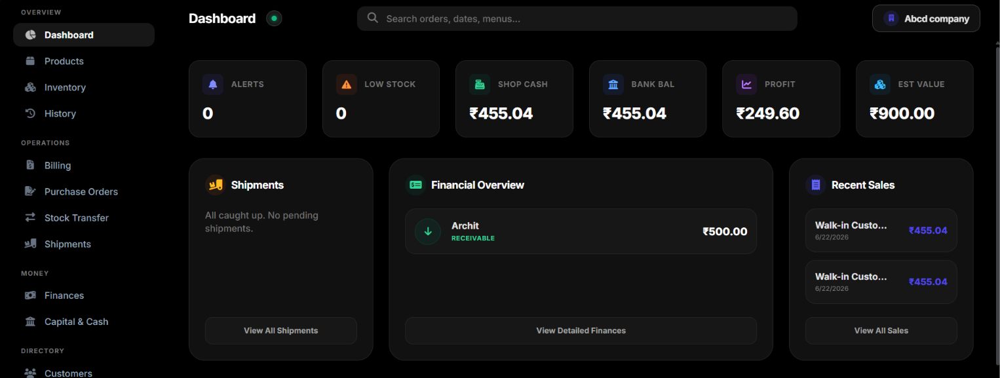

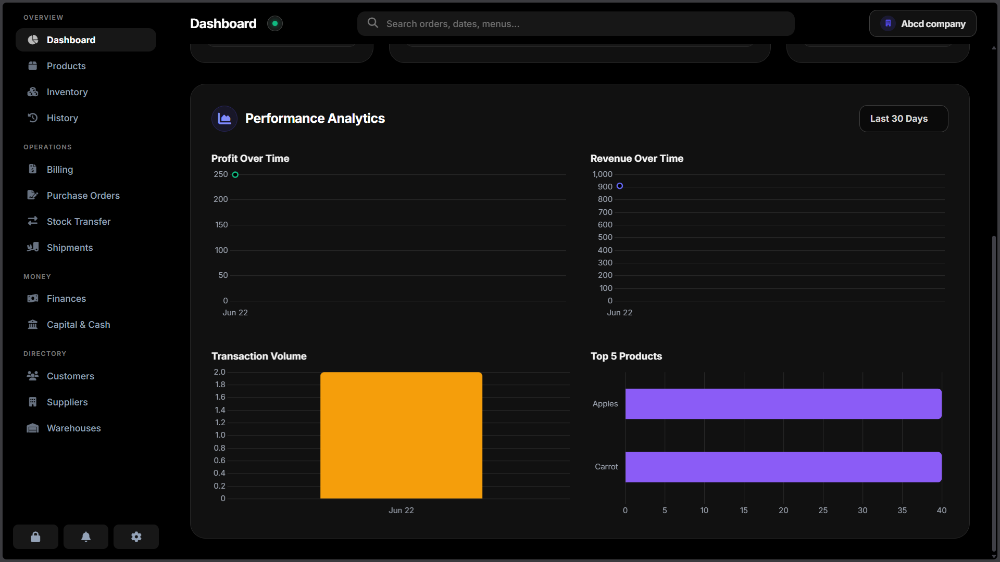

---

### Products Master
The master catalog where you define and manage everything you sell.

* **How it works:** This module acts as the single source of truth for pricing and SKUs. It features an advanced costing engine that calculates your "Total Unit Cost" by tracking base purchase averages, transport costs, and storage/cooling variables. It also monitors global stock levels against your defined minimum thresholds.
* **How to use:** Click the **"+ New Product"** button to open the creation modal. You must provide a Name, SKU, and Selling Price. You can optionally set a "Min Threshold" to trigger low-stock alerts. In the "Warehouse Inventory" section of the modal, you can distribute the initial stock quantities directly to your physical facilities or leave them in the "Unassigned" transit pool. Use the top search bar to instantly filter the table by name or SKU.

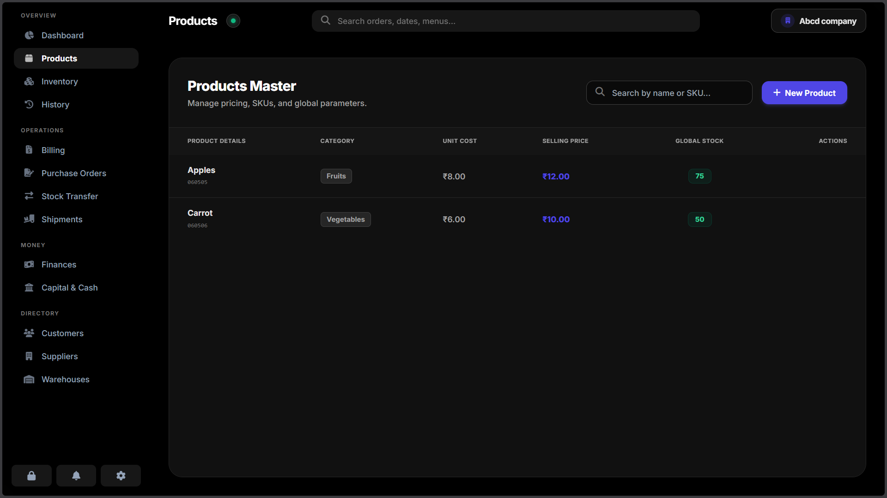

---

### Inventory
A visual logistics map showing exactly where your physical assets are located.

* **How it works:** It reads the internal allocation data of every product to build visual capacity bars for each registered facility (e.g., Main Hub, Cold Storage) and the Unassigned/Transit pool. The progress bars dynamically change to red if an item drops below its defined safety threshold in that specific location.
* **How to use:** Scroll through the location cards to monitor warehouse health visually. If you need to perform a physical stock audit or correct a discrepancy, click the **"Sliders/Adjust" icon** in the top right of any warehouse card. This opens a "Manual Override" grid where you can instantly sync new quantities for any item in that location.

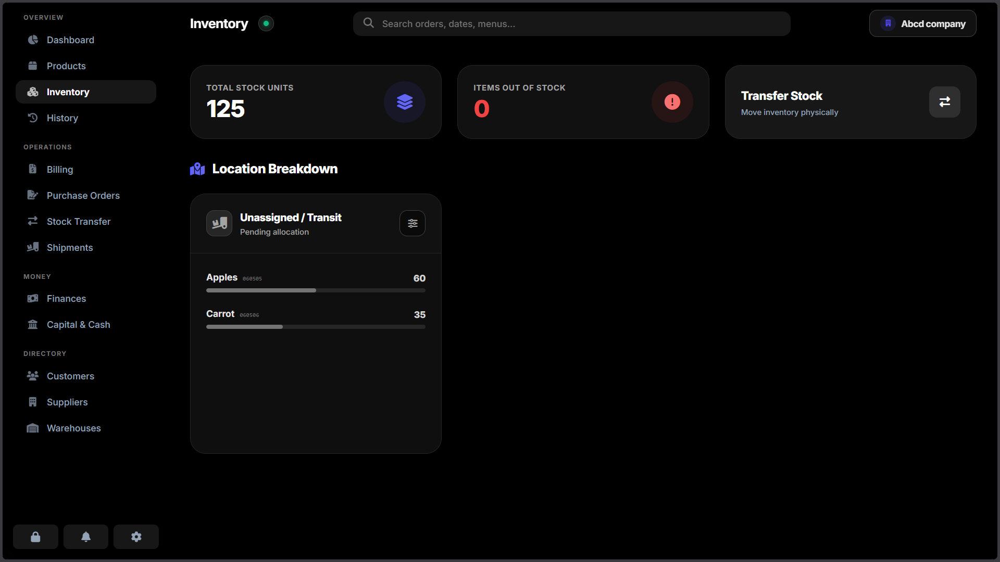

---

### History (Sales Ledger)
A complete, immutable ledger of all finalized Point of Sale (POS) transactions.

* **How it works:** Every time an order is processed in the Billing module, it is permanently logged here with its unique Invoice Code, customer identity, payment terms (Paid vs. Credit), and the exact line items sold.
* **How to use:** Use the "From Date" and "To Date" calendar inputs at the top to isolate specific business periods; the "Selected Revenue" card will automatically recalculate based on your filters. In the Actions column on the right, use the **Eye icon** to view and reprint the tax invoice, the **Pen icon** to modify the invoice (which automatically injects/deducts returned inventory and adjusts customer credit), or the **Trash/Ban icon** to void the transaction entirely.

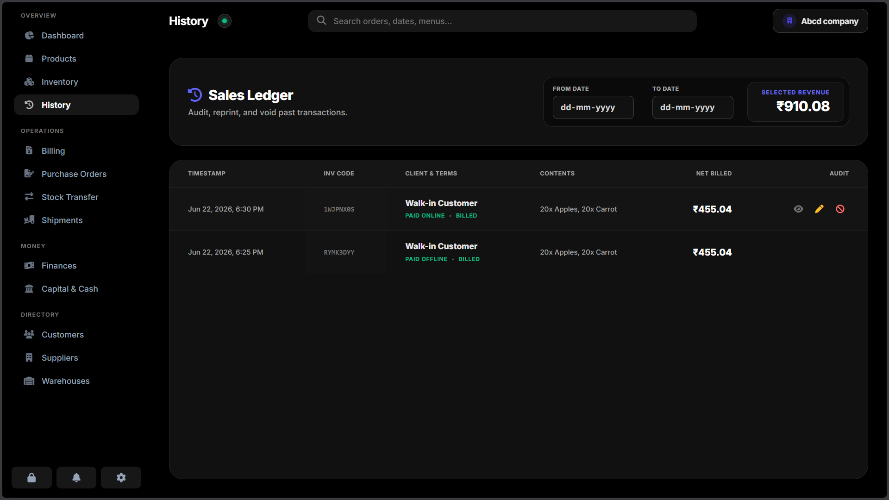

---

## ⚙️ Operations Section

The Operations suite provides the tools necessary for the physical movement, procurement, and sale of your inventory. 

### Billing (POS)
A high-speed Point of Sale terminal designed for rapid transaction processing with minimal friction.

* **How it works:** This module handles checkout logistics, dynamically applying item-level or global cart discounts (percentage or fixed amount). It supports tax exclusion toggles and multi-tender payments, including Online Bank, Offline Cash, or Credit. When a sale is processed, the system automatically deducts stock (prioritizing the "Main Hub" first, then cascading to other locations) and updates the customer's outstanding balance if bought on credit.
* **How to use:** Use the top search bar to find products by name, SKU, or by scanning a barcode. Click a product to add it to the "Current Cart". Inside the cart, adjust quantities using the `+`/`-` buttons or direct input. Select a registered Customer to enable "Credit" payments and view their standing balance, or leave it as a Walk-in. Finalize the transaction by clicking **"Quick Save"** (logs data only) or **"Print Bill"** to generate a styled, printable HTML invoice.

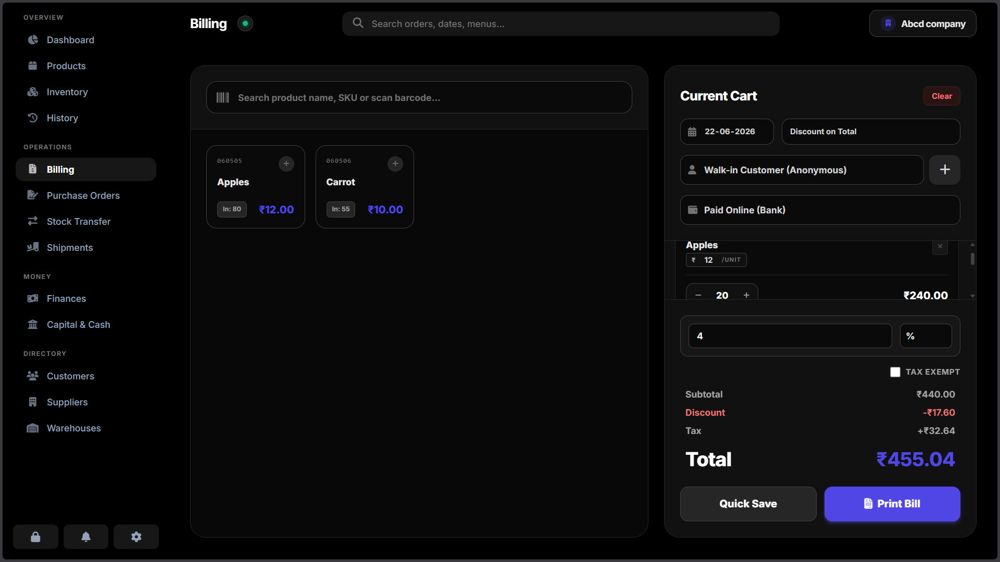

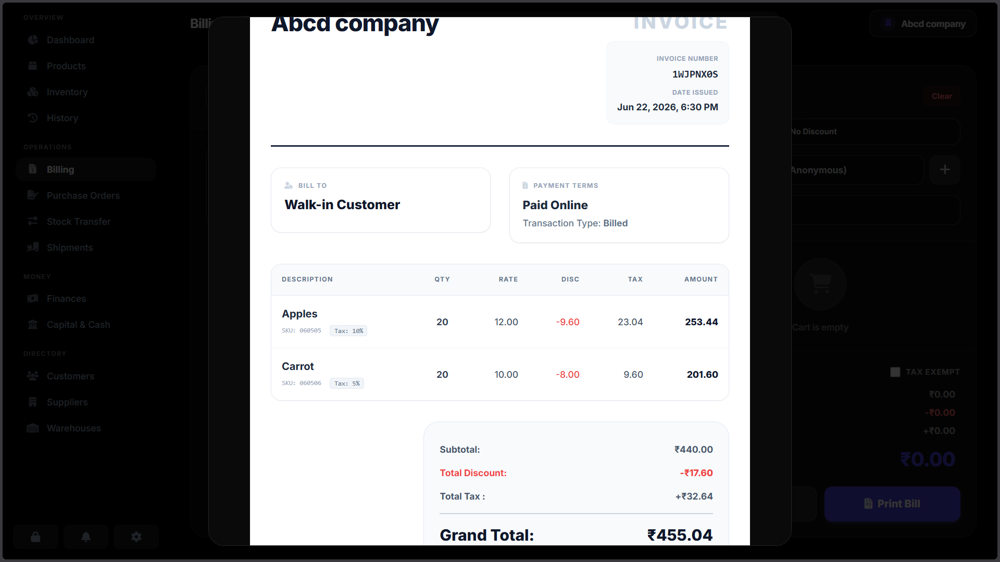

---

### Purchase Orders
The procurement center for drafting vendor orders and estimating landing costs.

* **How it works:** This module allows you to build multi-item supply requests. If "Transport Cost Calculation" is enabled in settings, you can add a global transport allocation, which the system will automatically distribute proportionally across the base cost of each item upon receipt. It routes items to specific destinations before they even arrive.
* **How to use:** First, select a Vendor from the dropdown (the product list will dynamically filter to only show items linked to that specific supplier). Select the product, choose its target Destination (a specific warehouse or Unassigned/Transit), input the requested quantity and estimated unit cost, then click **"Insert Line Item"**. Once your draft is complete, click **"Submit Order to Shipments"** to push the request to your logistics pipeline.

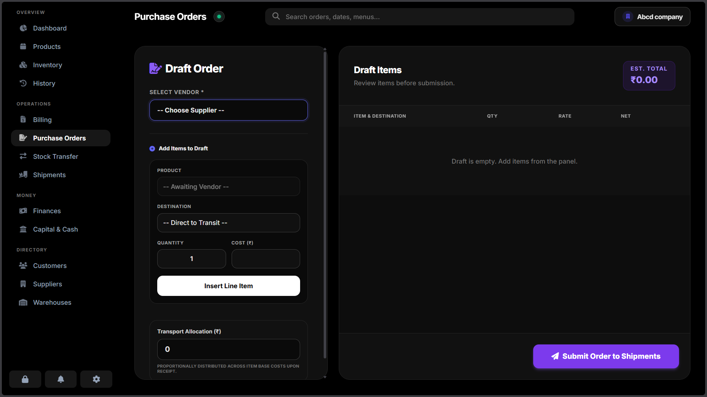

---

### Stock Transfer
A dedicated routing tool for dispatching inventory between physical locations.

* **How it works:** Transfers instantly deduct stock from an origin facility and credit it to a destination hub. Every movement is permanently logged in the system's `transfers` database collection, ensuring a complete audit trail of internal asset routing, including optional transit costs.
* **How to use:** Select the "Subject Product" you wish to move. Choose the "Origin Warehouse" (the system will display the exact quantity currently available to move from that location) and the "Destination Hub". Enter the Transfer Amount and any associated Transport Cost, then click **"Dispatch Transfer"** to execute the movement.

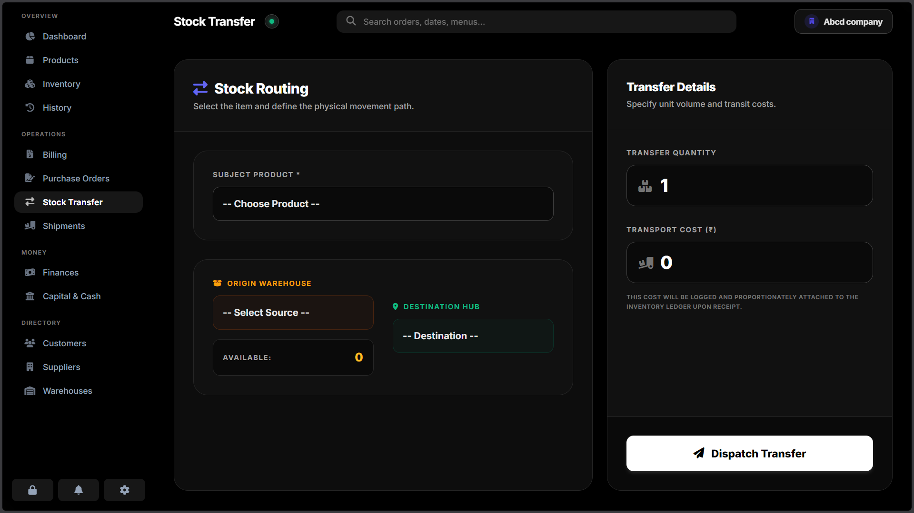

---

### Shipments
The logistics tracking center where incoming vendor orders are received and processed into live inventory.

* **How it works:** When a Purchase Order is submitted, it arrives here as "Pending". Receiving a shipment group triggers the system's moving average algorithms—it automatically recalculates the product's overall Base Cost and Transport Cost averages based on the new batch, adds the items to the designated warehouse, and credits the supplier's "Accounts Payable" balance.
* **How to use:** Locate your active orders in the Shipments manifest. Items are grouped by their targeted destination. Click the green **"Receive"** button to finalize the arrival of a specific group, or click the red **"X / Void"** button to cancel that portion of the order. Once all groups in an order are processed, the order shifts to a "Completed" or "Cancelled" state and can be archived/deleted.

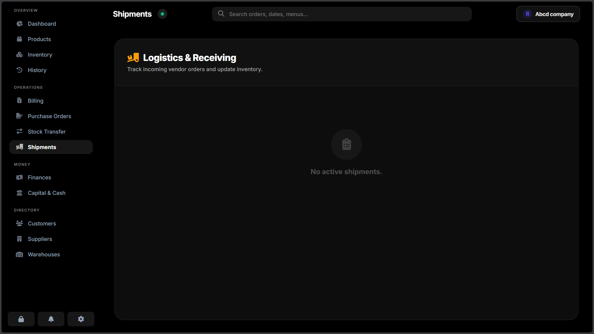

---

## 💵 Money Section

The Money suite moves beyond simple inventory valuation to provide comprehensive tracking of your actual cash flow, outstanding debts, and liquid capital.

### Finances
Your central dashboard for managing outstanding accounts receivable and accounts payable.

* **How it works:** The system actively scans all Customer and Supplier profiles to aggregate total debts. The left panel displays "To Collect" balances owed to you by customers (typically generated from POS "Credit" sales), while the right panel displays "To Pay" balances you owe to vendors (typically generated from receiving Shipments).
* **How to use:** Review the list of pending balances. To settle an account, click the **"Collect"** button for a customer or the **"Pay"** button for a supplier. Enter the remittance amount and select the payment source/destination (Online Bank or Offline Cash). The system will instantly deduct the balance and log the transaction in the Capital Ledger.

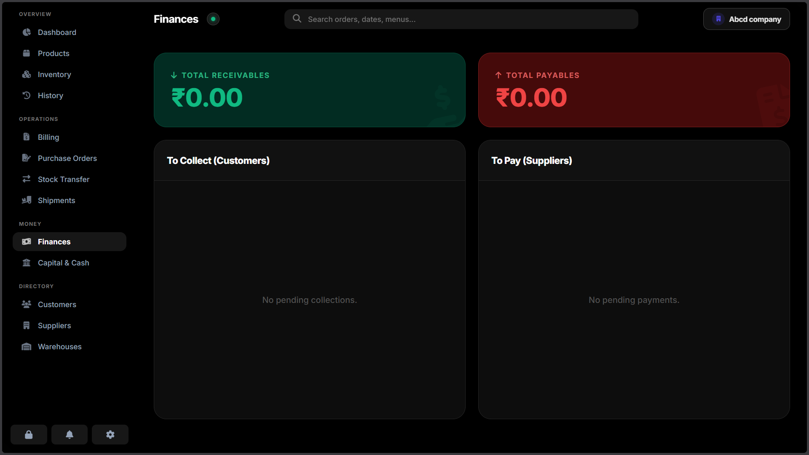

---

### Capital & Cash
*(Note: This module is only accessible if "Enhanced Mode" is enabled in Settings)*

A strict, double-entry style ledger that maintains running balances for your internal Bank Accounts and physical Shop Cash.

* **How it works:** This module bridges the gap between your inventory system and real-world liquidity. When a POS sale is processed as "Paid Online", funds are automatically routed to the Bank Balance; "Paid Offline" routes to Shop Cash. The Capital Ledger records every manual injection, withdrawal, and operational transfer with exact timestamps and descriptions.
* **How to use:** Use the top action buttons to manually **"Add Funds"** (e.g., owner investment), **"Withdraw"** (e.g., business expenses), or **"Transfer Between Accounts"** (e.g., depositing shop cash into the bank at the end of the day). Review the ledger table below to audit all historical capital movements.

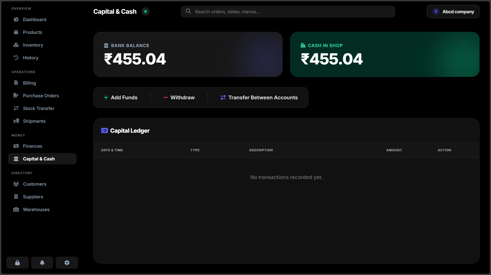

---

## 📇 Directory Section

The Directory acts as your business relationship management hub, storing the profiles and configurations necessary to route orders and process billing.

### Customers
The client management directory for tracking buyer profiles and their standing credit lines.

* **How it works:** Profiles created here become selectable entities in the POS Billing terminal. Linking a customer to a sale allows you to process transactions on "Credit" and logs the transaction in their historical audit trail.
* **How to use:** Click **"New Client"** to register a profile. You can assign them a Company Affiliation, set an opening balance (if they currently owe you money), and assign a Client Rating (1-5 stars). Use the inline action buttons on the table to edit profiles, settle their specific balances via the double-check icon, or permanently void their record.

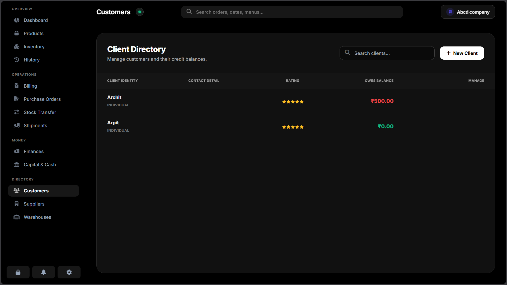

---

### Suppliers
Your vendor network directory, intrinsically linked to the procurement pipeline.

* **How it works:** Suppliers must be registered here before you can generate Purchase Orders for them. Crucially, the system allows you to map specific products from your master catalog to individual vendors, ensuring you only order the correct SKUs from the correct suppliers.
* **How to use:** Click **"New Vendor"** to input their enterprise details and contact information. In the "Authorized Supply Catalog" section of the modal, check the boxes next to the products this specific vendor provides. You can also track their "Outstanding (Owed)" balance and remit payments directly from the actions column.

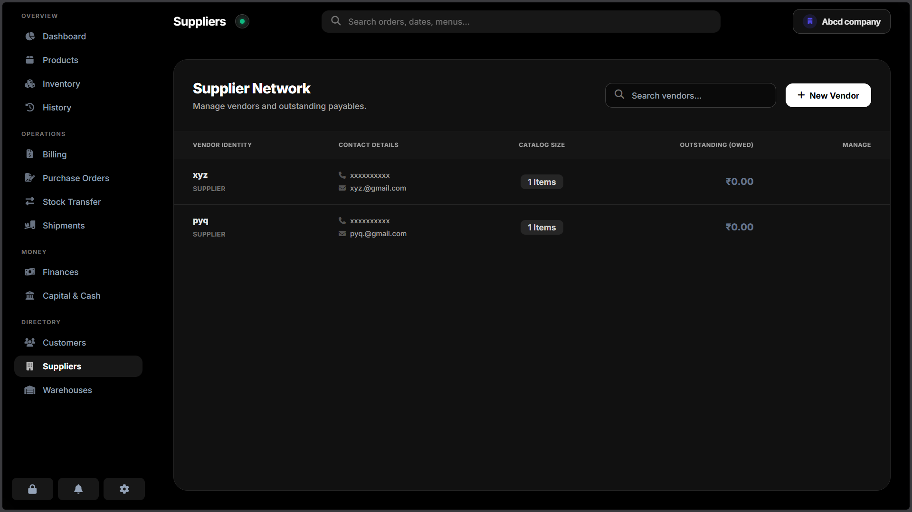

---

### Warehouses
The configuration panel for your physical and digital infrastructure.

* **How it works:** Facilities defined here populate the destination dropdowns in the Purchase Orders and Stock Transfer modules, and generate the visual capacity bars in the Inventory module. One facility can be designated as the "Main Hub," making it the default target for quick stock receiving and priority low-stock alerts.
* **How to use:** Click **"New Facility"** to define a warehouse name and geo-location. Check the "Designate as Main Hub" box if applicable. If you need to perform an immediate stock correction without logging a formal transfer, click the **"Adjust"** button in the table to open the Manual Override grid for that specific location.

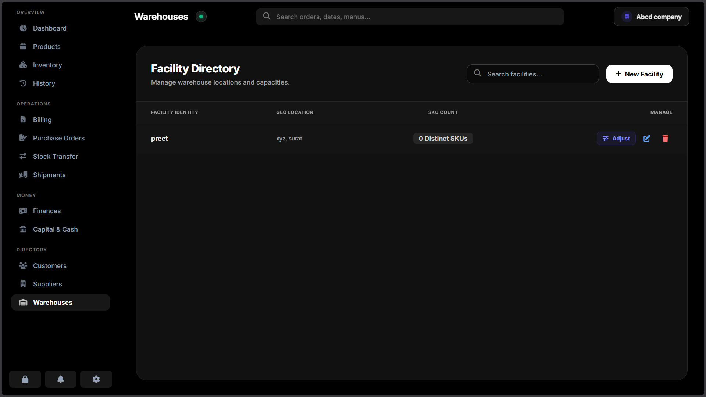

---

## 🗺️ Development Roadmap

**Phase 1: Core Architecture & PC UI (✅ Completed)**
- [x] Implement Zero-Knowledge End-to-End Encryption (AES-GCM).
- [x] Build dual-storage system (Local Device Cache & Firebase Cloud Sync).
- [x] Develop foundational modules: Dashboard, Products, POS Billing, and Facilities.
- [x] Integrate Enhanced Mode (Capital Ledger, Bank & Shop Cash tracking).
- [x] Implement dynamic Light/Dark mode and global command palette (Ctrl+M).

**Phase 2: Mobile Portability & Export Upgrades (🔄 Current Focus)**
- [ ] Optimize all tables, sidebars, and POS grid layouts for seamless mobile viewports.
- [ ] Integrate direct WhatsApp, SMS, and Email bill-sharing APIs.
- [ ] Implement client-side PDF generation (e.g., `jsPDF`) to convert HTML invoices into downloadable files.
- [ ] Extensive cross-device bug fixing and UI performance auditing.

**Phase 3: Enterprise Features & Advanced Integrations (📅 Planned)**
- [ ] **Camera Barcode Scanning:** Implement `Html5Qrcode` to allow standard mobile cameras and PC webcams to scan physical items directly into the POS cart.
- [ ] **Role-Based Access Control (RBAC):** Create secondary cryptographic keys for subordinate roles (e.g., a "Cashier" role that can access the POS, but cannot view the Capital Ledger or System Settings).
- [ ] **Backend Service Migration:** Transition heavy reporting aggregation and automated cron tasks to a dedicated REST API utilizing Java Spring Boot.
- [ ] **Predictive AI Forecasting:** Introduce an AI-driven inventory agent utilizing deep learning to analyze historical sales data, forecast demand spikes, and automatically draft purchase orders before items hit their minimum thresholds.

---
